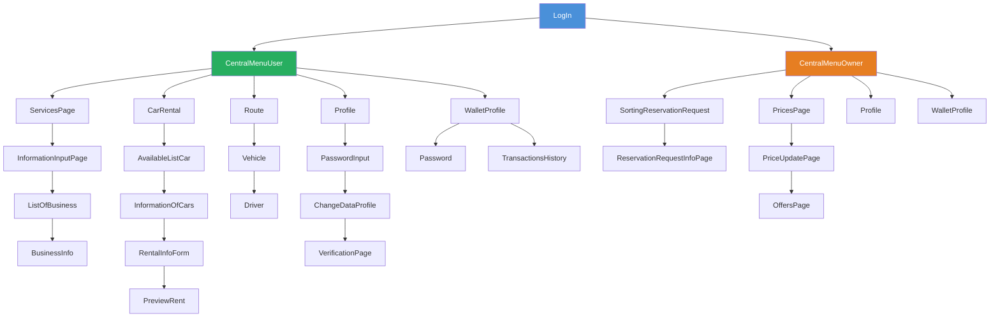

# PeDri — Car Services Platform

Android application for managing car-related services, developed as part of the **Software Engineering** course at the **University of Patras**.
---

## 📱 About

PeDri is a mobile app that connects **users** with **business owners** offering car services. Users can search, book, and pay for services, while owners can manage reservations and pricing — all from a single platform.

---

## ✨ Features

### 👤 User
- **Parking** — Search available parking spots by location, date & time, and book instantly
- **Car Wash** — Find and reserve car wash slots in your area
- **Car Rental** — Browse available cars by location, date, and cost (ascending/descending)
- **Carpooling** — Search for rides as a passenger or post a route as a driver
- **Digital Wallet** — Top up via Paysafe card and pay for services in-app
- **Transaction History** — View all past payments and top-ups
- **Profile Management** — Update personal details with password verification

### 🏢 Owner
- **Reservation Management** — View and manage incoming parking & car wash bookings
- **Pricing** — Update service prices; compare against area average
- **Offers** — Automatically suggest creating an offer when a price drops below the area average
- **Wallet** — Track earnings and transaction history

## Architecture

---

## 🛠️ Tech Stack

| Layer | Technology |
|-------|-----------|
| Language | Java |
| Platform | Android (API 21+) |
| Database | MySQL (remote via JDBC) |
| UI | XML Layouts + RecyclerView |
| Async | ExecutorService, AsyncTask, Handler |]

---
## 🎓 What I Learned

Working on this project gave me hands-on experience across the full software development lifecycle:

**Software Engineering & Design**
- Wrote full SE documentation: Project Description, Risk Management plan, Team Plan
- Modeled the system with UML: Use Cases, Robustness Diagrams, Sequence Diagrams, Class Diagram, Domain Model
- Applied SE methodology from requirements analysis through to implementation

**Android Development**
- Built a multi-screen Android app in Java with a real MySQL database
- Connected Android to MySQL directly via JDBC
- Handled background threads with `ExecutorService`, `AsyncTask`, and `Handler` to keep the UI responsive
- Managed navigation between 20+ Activities passing data via Intents

**Teamwork & Tools**
- Collaborated in a team using Git for version control
- Divided work across 4 phases with incremental deliveries
- Studied Agile methodologies: Scrum & Kanban
------
## 👥 Team
- Developed by a team of 4 students.
---
